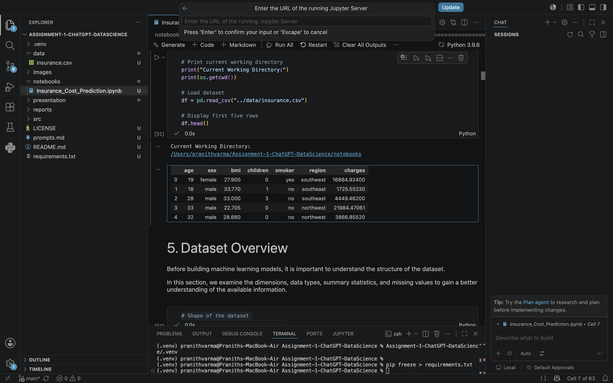
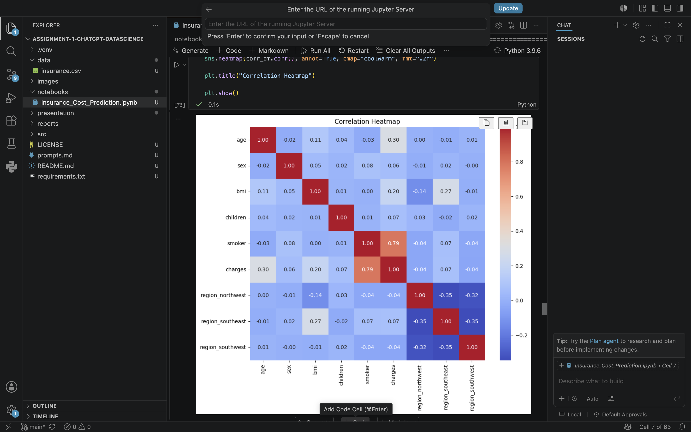
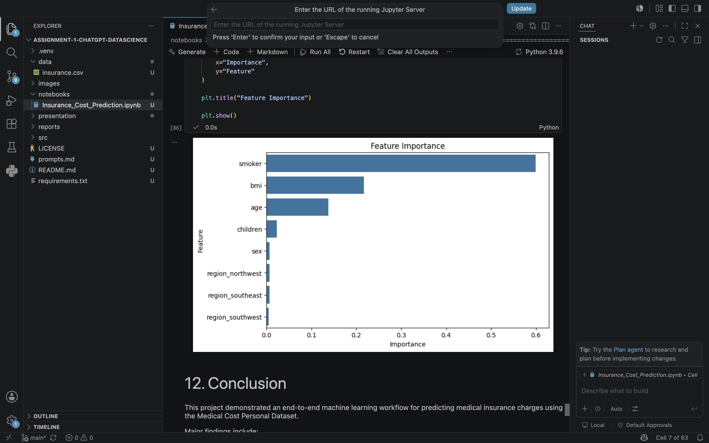
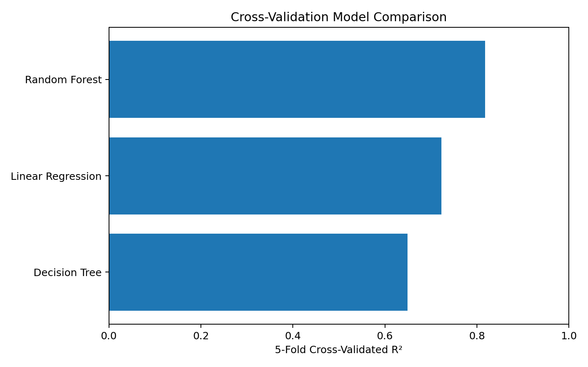
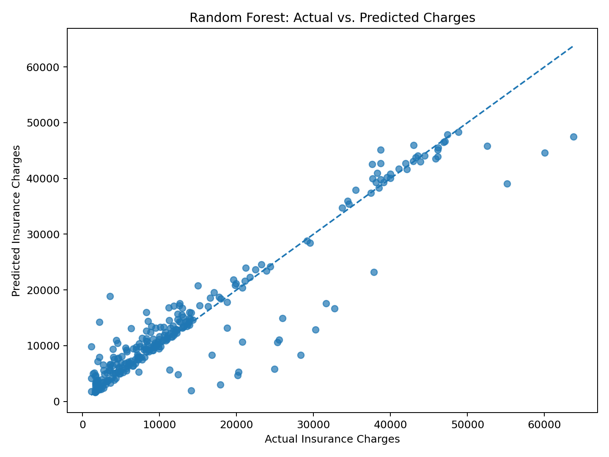
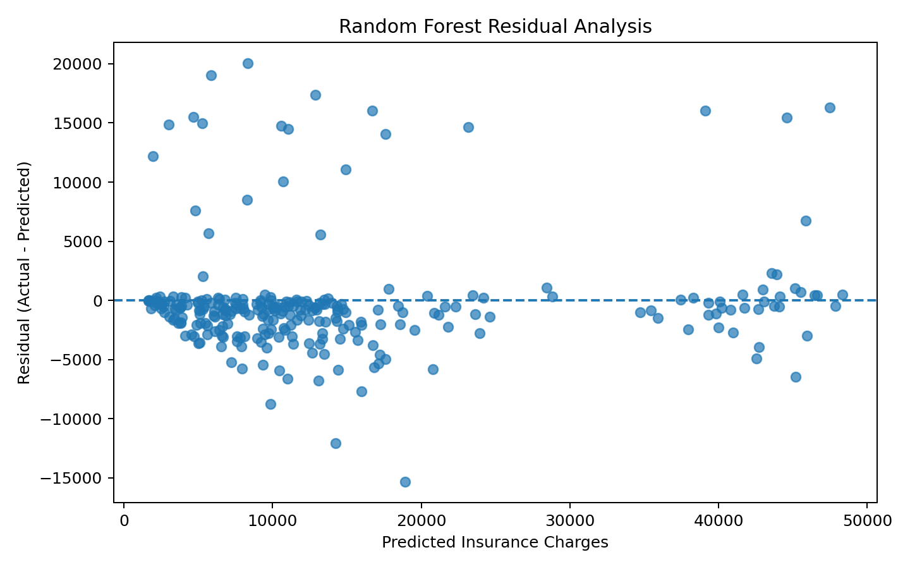
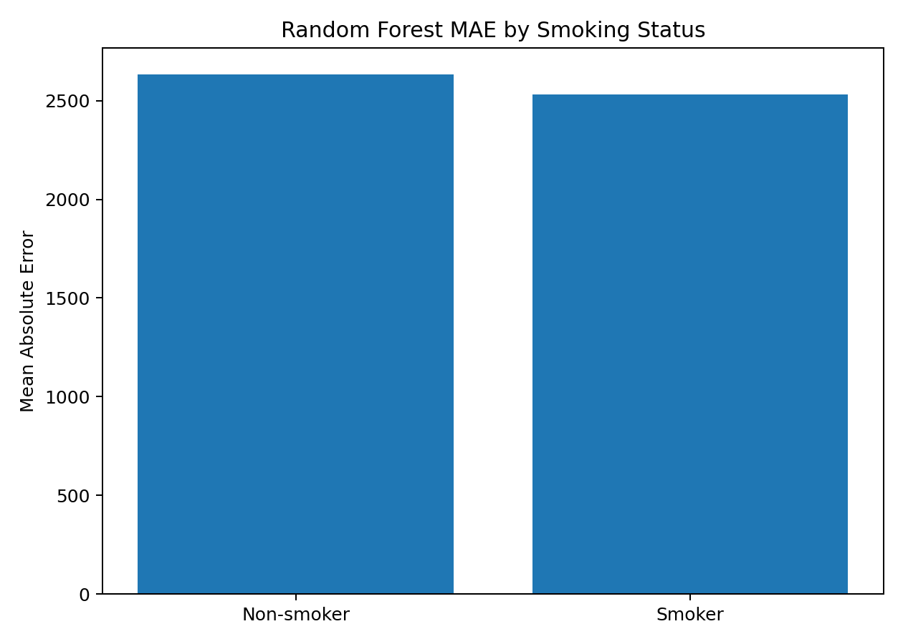
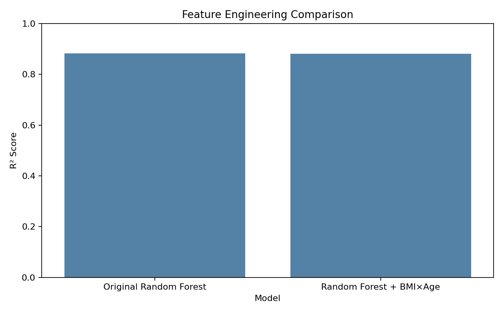

# Assignment Part 1: End-to-End Data Science

## Project

**Medical Insurance Cost Prediction Using Machine Learning**

This project demonstrates an end-to-end, chatbot-assisted data science workflow using the Kaggle Medical Cost Personal Dataset. The objective is to predict individual medical insurance charges from demographic and health-related attributes.

The workflow is organized using CRISP-DM principles and includes data understanding, data preparation, exploratory analysis, preprocessing, regression modeling, validation, error analysis, feature engineering, feature importance, and interpretation.

## Submission Artifacts

| Artifact | Location |
|---|---|
| End-to-end notebook | [`notebooks/Insurance_Cost_Prediction.ipynb`](notebooks/Insurance_Cost_Prediction.ipynb) |
| Kaggle dataset | [`data/insurance.csv`](data/insurance.csv) |
| Visual evidence | [`images/`](images/) |
| ChatGPT development record | [`chatgpt_transcript.md`](chatgpt_transcript.md) |
| ChatGPT development record PDF | [`chatgpt_transcript.pdf`](chatgpt_transcript.pdf) |
| Prompt history | [`prompts.md`](prompts.md) |
| Written report | [`reports/FINAL_REPORT.md`](reports/FINAL_REPORT.md) |
| Report PDF | [`reports/FINAL_REPORT.pdf`](reports/FINAL_REPORT.pdf) |
| YouTube script | [`presentation/youtube_script.md`](presentation/youtube_script.md) |
| Medium article | [Published Medium article](https://medium.com/@pranithvarma.234/end-to-end-medical-insurance-cost-prediction-using-machine-learning-3e620acb6780?sharedUserId=pranithvarma.234) |
| YouTube walkthrough | [Published Part 1 walkthrough](https://youtu.be/EbGIbGuOWpA) |

## 1. Problem Understanding

### Objective

Predict the medical insurance charge for an individual from the available demographic and health-related features.

### Problem Type

Regression, because `charges` is a continuous numerical target.

### Dataset

**Medical Cost Personal Dataset** from Kaggle.

Source: https://www.kaggle.com/datasets/mirichoi0218/insurance

The original dataset contains 1,338 rows and 7 columns. One duplicate record was detected and removed, leaving 1,337 observations for modeling.

| Feature | Role / Description |
|---|---|
| `age` | Age of the individual |
| `sex` | Sex of the individual |
| `bmi` | Body Mass Index |
| `children` | Number of dependent children |
| `smoker` | Smoking status |
| `region` | Geographic region |
| `charges` | Continuous insurance-cost target |

## 2. CRISP-DM Workflow

| Phase | Work completed |
|---|---|
| Business Understanding | Defined the insurance-cost prediction problem and project objective. |
| Data Understanding | Inspected schema, types, distributions, missing values, duplicates, and target behavior. |
| Data Preparation | Removed the duplicate record and encoded categorical variables for modeling. |
| Modeling | Trained Linear Regression, Decision Tree, and Random Forest regressors. |
| Evaluation | Used MAE, RMSE, R², a mean baseline, and 5-fold cross-validation. |
| Interpretation | Analyzed feature importance, predictions, residuals, subgroup error, and feature-engineering impact. |
| Communication | Produced visual evidence, a report, Medium article, development record, and video walkthrough. |

## 3. Data Quality and Preparation

The notebook performs checks for dataset dimensions, column names, data types, descriptive statistics, missing values, duplicates, and category encoding.

### Cleaning result

- Missing values detected: **0**
- Duplicate rows detected: **1**
- Duplicate rows removed: **1**
- Final modeling rows: **1,337**

The target variable is kept unchanged while categorical predictors are encoded for modeling.

## 4. Exploratory Data Analysis

### 4.1 Dataset Preview



**What it shows:** A sample of the dataset and its seven variables.

**Interpretation:** The preview confirms the expected structure and shows the mix of numerical and categorical inputs that require appropriate preprocessing before regression.

### 4.2 Correlation Heatmap



**What it shows:** Pairwise correlations among the modeled variables and the insurance-charge target.

**Interpretation:** Smoking status, BMI, and age show the clearest relationships with charges. Correlation is descriptive and does not establish causation.

### 4.3 Insurance Charges by Smoking Status


**What it shows:** The charge distributions for smokers and non-smokers.

**Interpretation:** Smokers show substantially higher and more variable charges. This pattern is consistent with the later Random Forest feature-importance results.

### 4.4 Model Comparison


**What it shows:** Held-out test-set performance for Linear Regression, Decision Tree, and Random Forest.

**Interpretation:** Random Forest provides the strongest overall test-set performance, indicating that nonlinear structure is useful for this prediction problem.

### 4.5 Random Forest Feature Importance



**What it shows:** The relative predictive importance of the encoded features in the fitted Random Forest.

**Interpretation:** Smoking status is the strongest predictor, followed by BMI and age. This is model-specific predictive importance, not a causal claim.

## 5. Modeling

Three regression approaches were evaluated:

1. **Linear Regression** — interpretable linear baseline.
2. **Decision Tree Regressor** — captures nonlinear relationships.
3. **Random Forest Regressor** — combines multiple trees to model more complex patterns.

A reproducible train/test split uses `random_state=42`.

## 6. Test-Set Performance

| Model | MAE | RMSE | R² |
|---|---:|---:|---:|
| Linear Regression | 4,177.05 | 5,956.34 | 0.8069 |
| Decision Tree Regressor | 2,730.63 | 5,769.01 | 0.8189 |
| **Random Forest Regressor** | **2,611.53** | **4,664.78** | **0.8816** |

**Interpretation:** Random Forest is the strongest model on the held-out test set. An R² of 0.8816 indicates that the model explains a large share of the variation in the test-set charges. MAE of approximately 2,612 charge units describes the average absolute prediction error.

## 7. Validation and Error Analysis

### 7.1 Cross-Validation



Five-fold cross-validation was performed on the training split.

| Model | Mean CV R² | R² Std. Dev. | Mean CV MAE | Mean CV RMSE |
|---|---:|---:|---:|---:|
| **Random Forest** | **0.8177** | 0.0294 | 2,776.56 | 4,946.11 |
| Linear Regression | 0.7228 | 0.0283 | 4,221.96 | 6,123.65 |
| Decision Tree | 0.6495 | 0.0489 | 3,356.80 | 6,871.12 |

**Interpretation:** Random Forest remains the strongest model across the training-set cross-validation comparison. The held-out test set remains the final evaluation reference.

### 7.2 Actual vs Predicted



**What it shows:** Predicted charges versus observed test-set charges.

**Interpretation:** Points close to the diagonal represent more accurate predictions. Larger deviations identify cases that are harder for the model to estimate.

### 7.3 Residual Analysis



**What it shows:** Residuals from the Random Forest predictions.

**Interpretation:** Residual analysis helps identify systematic prediction errors and complements MAE, RMSE, and R².

### 7.4 Subgroup Error Analysis



**What it shows:** Mean absolute error by smoking-status group.

**Interpretation:** Aggregate metrics can hide differences in prediction difficulty across meaningful groups, so subgroup error is included as an additional diagnostic.

## 8. Feature Engineering Experiment

A BMI-age interaction feature was added as an explicit feature-engineering experiment:

`bmi_age_interaction = BMI × age`



The original Random Forest achieved **R² 0.8816**, while Random Forest with the BMI-age interaction achieved **R² 0.8803** on the same holdout split. The engineered feature therefore did not improve the model, so the original Random Forest remains the preferred specification.

This negative result is intentionally documented rather than omitted. It demonstrates that feature engineering is evaluated empirically instead of assuming that additional variables automatically improve generalization.

## 9. Key Findings

1. Smoking status is the strongest predictive feature in the fitted Random Forest model.
2. BMI and age are the next most influential predictors.
3. Random Forest outperforms Linear Regression and Decision Tree on the held-out test set.
4. Five-fold cross-validation preserves the same model ranking.
5. The BMI-age interaction did not improve the selected Random Forest model.
6. Error and subgroup diagnostics provide additional context beyond one aggregate metric.

## 10. Limitations and Responsible Interpretation

- The dataset contains 1,338 original observations.
- The available variables do not represent every factor that influences medical costs.
- The held-out test set is based on one reproducible train/test split.
- Cross-validation provides additional evidence but is not external validation.
- The models identify predictive relationships, not causal effects.
- Feature importance should not be interpreted as a causal effect.
- This demonstration model should not be used alone for medical, insurance, or financial decisions.

## 11. ChatGPT-Assisted Development

ChatGPT was used as a coding and reasoning assistant for project planning, CRISP-DM organization, code generation, debugging guidance, EDA planning, model implementation, interpretation, and documentation.

The development artifacts are:

- [`prompts.md`](prompts.md)
- [`chatgpt_transcript.md`](chatgpt_transcript.md)

The workflow emphasizes human verification: generated code was executed, observed outputs were inspected, and conclusions were based on the resulting data and metrics.

## 12. Reproducibility

From this folder:

```bash
pip install -r requirements.txt
jupyter notebook notebooks/Insurance_Cost_Prediction.ipynb
```

The notebook is saved with executed outputs and contains the complete analysis workflow.

## 13. Publishing

- Medium article: [End-to-End Medical Insurance Cost Prediction Using Machine Learning](https://medium.com/@pranithvarma.234/end-to-end-medical-insurance-cost-prediction-using-machine-learning-3e620acb6780?sharedUserId=pranithvarma.234)
- YouTube walkthrough: [Published Part 1 walkthrough](https://youtu.be/EbGIbGuOWpA)
