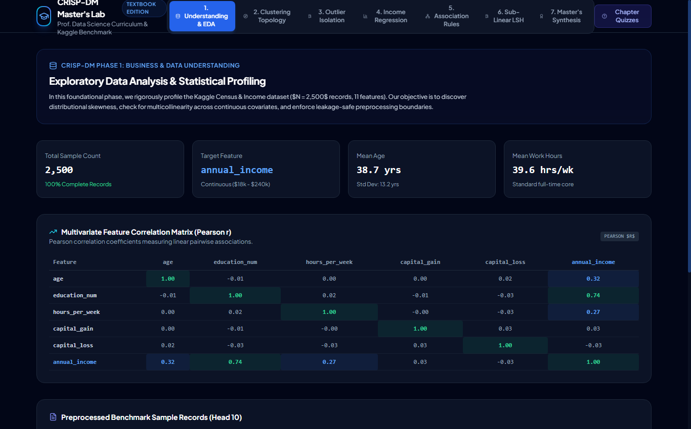
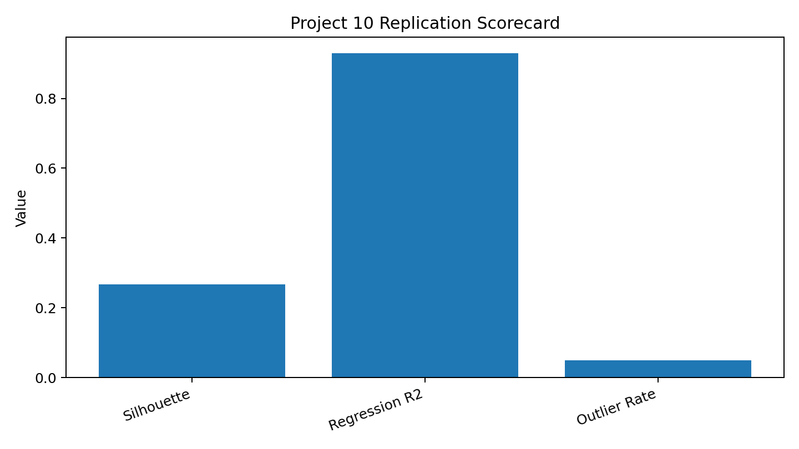

# Project 10 — CRISP-DM Master's Platform: Creative Replication

**Reference:** `10_crispdm_masters_curriculum`

## Objective

Replicate the reference project's teaching pattern of a multi-phase CRISP-DM analytics workflow using a deterministic census-style dataset and a compact local implementation.

## What I Replicated

I retained the reference experiment's central analytical ideas: correlation-based data understanding, K-Means clustering, Isolation Forest outlier detection, income regression, association-style rule discovery, and cosine-similarity locality hashing.

## What I Changed / Improved

1. Added cluster stability analysis for **k = 3, 4, and 5** instead of reporting a single arbitrary cluster configuration.
2. Added a consolidated quantitative scorecard covering clustering, regression, anomaly rate, and similarity results.
3. Added transparent association-style rule calculations and a detailed local-neighbor table so the analytical logic is inspectable.
4. Converted the multi-service reference concept into a deterministic Python workflow that can run in a course environment without the original application stack.

## Results

- Best cluster count: **k = 3**
- Best silhouette: **0.2677**
- Income regression R²: **0.9288**
- Isolation Forest outlier rate: **5.0%**
- Maximum retained cosine similarity: **0.9989**

## Evidence



The reference screenshot is included only for source traceability.



The scorecard summarizes the local quantitative results. Machine-readable output is available in [`artifacts/scorecard.csv`](artifacts/scorecard.csv), with additional files for clustering, outliers, association-style rules, and LSH neighbors.

## Reproducibility

```bash
python replication.py
```

Validation tests are in [`tests/test_replication.py`](tests/test_replication.py).

## Limitations

The dataset is generated locally as a census-style educational proxy. It is not claimed to reproduce the exact hidden data or production infrastructure of the reference project.
