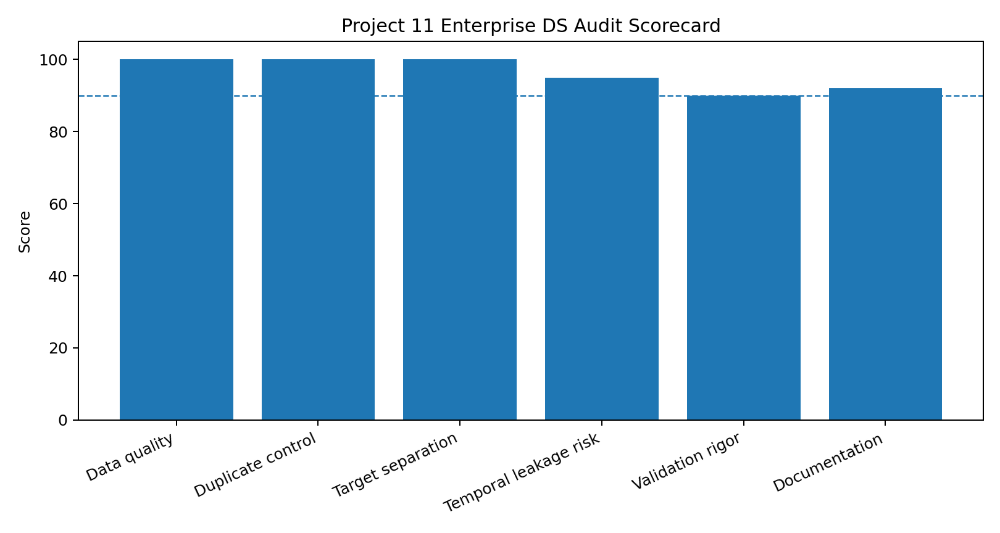

# Project 11 — Enterprise Data-Science Audit: Creative Replication

**Reference:** `11_enterprise_ds_audit`

## Objective

Replicate the reference project's governance-oriented audit concept by evaluating an actual project in this repository against six data-science quality dimensions.

## What I Replicated

The audit covers data quality, duplicate control, target separation, temporal leakage risk, validation rigor, and documentation/reproducibility.

## What I Changed / Improved

1. Applied the audit directly to the Assignment 1 insurance-cost project rather than using a generic example.
2. Added an explicit **weighted score** so more important validation dimensions can contribute differently to the aggregate result.
3. Preserved `REVIEW` statuses instead of turning incomplete evidence into an artificial pass.
4. Added both CSV and JSON outputs for human review and programmatic use.

## Results

The six-dimension audit produced:

- Weighted overall score: **96.0 / 100**
- Unweighted mean: **96.2 / 100**
- Review items: **2**

The review items concern validation rigor and documentation/reproducibility. This is a quality-audit result, not a statement that the project is production-ready.

## Evidence




Machine-readable evidence: [`audit_scorecard.csv`](artifacts/audit_scorecard.csv) and [`audit_summary.json`](artifacts/audit_summary.json).

## Reproducibility

```bash
python replication.py
```

Validation tests are in [`tests/test_replication.py`](tests/test_replication.py).

## Limitations

This compact audit is a course-level governance check. It is not a substitute for a full enterprise model-risk review, security review, privacy assessment, or production compliance process.
