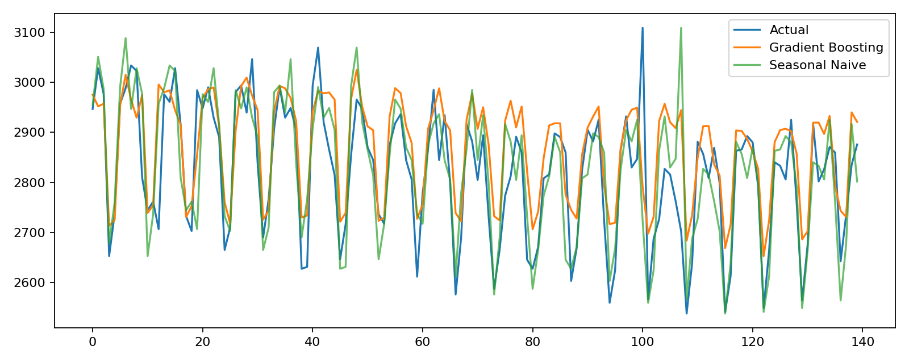
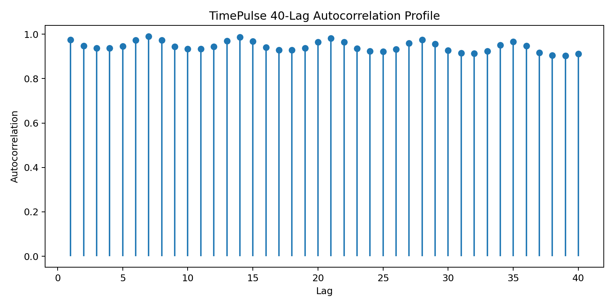

# Project 12 — TimePulse Forecasting: Creative Replication

**Reference:** `12_timeseries_forecasting`

## Objective

Replicate the reference project's synthetic demand-forecasting workflow with trend, seasonality, lag features, chronological evaluation, and anomaly-aware diagnostics.

## What I Replicated

I retained the synthetic daily-demand structure, trend and seasonal components, lagged predictors, rolling statistics, and chronological holdout design.

## What I Changed / Improved

1. Added a **seasonal-naive benchmark** so the machine-learning model is judged against a meaningful time-series baseline.
2. Added a **40-lag autocorrelation profile** to expose longer-range temporal structure.
3. Added rolling anomaly flags for diagnostic review.
4. Kept a strict chronological split with no random shuffling and exported the forecast table for inspection.

## Results

| Model | MAE | RMSE | MAPE |
|---|---:|---:|---:|
| Gradient Boosting | 69.896 | 89.852 | 2.516% |
| Seasonal Naive | **60.101** | **86.853** | **2.125%** |

The seasonal-naive baseline is stronger on the generated test period. This is a useful result because it demonstrates that a more complex model does not automatically outperform a strong seasonal benchmark.

## Evidence






The 40-lag plot exposes longer-range temporal structure. Additional machine-readable evidence is available in [`metrics.csv`](artifacts/metrics.csv), [`forecast.csv`](artifacts/forecast.csv), [`forecast_diagnostics.csv`](artifacts/forecast_diagnostics.csv), and [`acf_40_lags.csv`](artifacts/acf_40_lags.csv).

## Reproducibility

```bash
python replication.py
```

Validation tests are in [`tests/test_replication.py`](tests/test_replication.py).

## Limitations

The demand series is synthetic, so these results illustrate the methodology rather than forecasting a live operational system.
