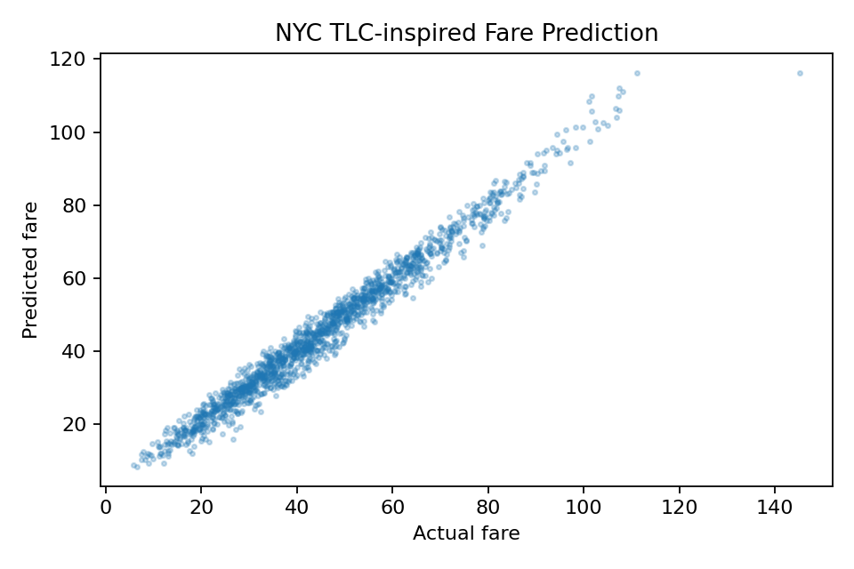

# Project 13 — NYC TLC Mobility Platform: Creative Replication

**Reference:** `13_crispdm_nyc_taxi_audit_platform`

## Objective

Replicate the reference project's end-to-end mobility-analysis concept with trip-feature engineering, predictive modeling, and mobility segmentation.

## What I Replicated

The local implementation covers trip distance, duration, speed, fare modeling, segmentation, and predictive evaluation.

## What I Changed / Improved

1. Added explicit **rush-hour** indicators.
2. Added **fare-per-mile** as a domain-specific efficiency measure for analysis, while keeping it out of the prediction feature set because it is derived from the target fare.
3. Added speed as a derived mobility feature and retained trip segmentation.
4. Added a mean baseline before nonlinear modeling.
5. Clearly marked the dataset as **synthetic** so the results are not presented as real NYC TLC observations.

## Results

The Histogram Gradient Boosting model achieved approximately **R² 0.976**, substantially outperforming the mean baseline on the synthetic evaluation set.

## Evidence




Additional evidence includes [`synthetic_taxi_trips.csv`](artifacts/synthetic_taxi_trips.csv), [`model_metrics.csv`](artifacts/model_metrics.csv), [`mobility_segments.csv`](artifacts/mobility_segments.csv), and [`rush_hour_fare_efficiency.csv`](artifacts/rush_hour_fare_efficiency.csv).

## Reproducibility

```bash
python replication.py
```

Validation tests are in [`tests/test_replication.py`](tests/test_replication.py).

## Limitations

This is a synthetic, course-scale adaptation of a much larger NYC TLC analytics platform. It does not claim to reproduce the original production data pipeline, application, or deployment architecture.
