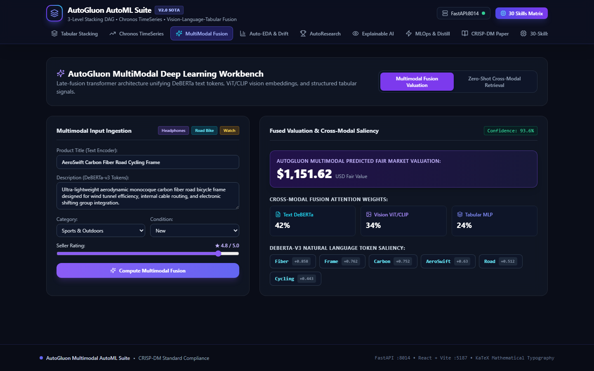
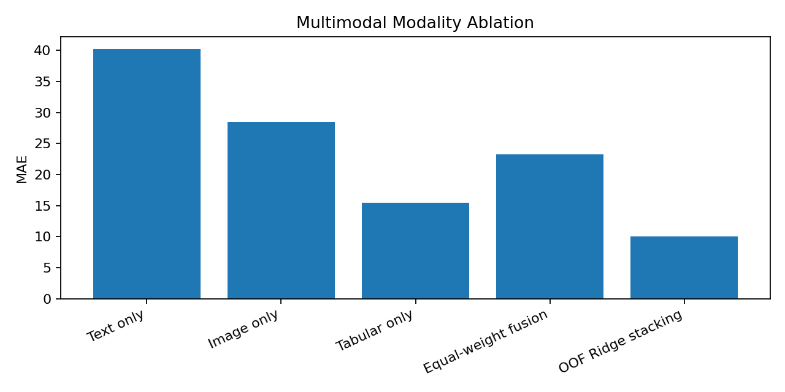

# Project 14 — AutoGluon Multimodal Suite: Creative Replication

**Reference:** `14_autogluon_multimodal_automl_suite`

## Objective

Replicate the reference project's multimodal learning concept by combining text, image-derived, and tabular information in a resource-aware local experiment.

## What I Replicated

The implementation preserves the core idea of multimodal valuation: separate modalities are modeled, compared, and then combined through a learned fusion model.

## What I Changed / Improved

1. Replaced heavyweight pretrained components with deterministic local feature extractors so the experiment is reproducible without downloading large foundation models.
2. Added **leakage-safe five-fold out-of-fold Ridge stacking** for the multimodal fusion stage.
3. Added **modality ablation** so the contribution of text, image, tabular, and fused inputs can be compared directly.
4. Exported per-modality predictions for auditability.

## Results

| Model | MAE | R² |
|---|---:|---:|
| Text only | 40.231 | -0.015 |
| Image only | 28.534 | 0.474 |
| Tabular only | 15.446 | 0.843 |
| Equal-weight fusion | 23.231 | 0.656 |
| **OOF Ridge stacking** | **10.020** | **0.934** |

## Evidence





Additional evidence: [`modality_ablation.csv`](artifacts/modality_ablation.csv) and [`fusion_predictions.csv`](artifacts/fusion_predictions.csv).

## Important Replication Note

This is a **lightweight conceptual adaptation**, not a claim that AutoGluon, Chronos, ViT, or other heavyweight foundation-model inference was executed. The goal is to preserve the multimodal-fusion idea while making the experiment auditable in a course environment.

## Reproducibility

```bash
python replication.py
```

Validation tests are in [`tests/test_replication.py`](tests/test_replication.py).
