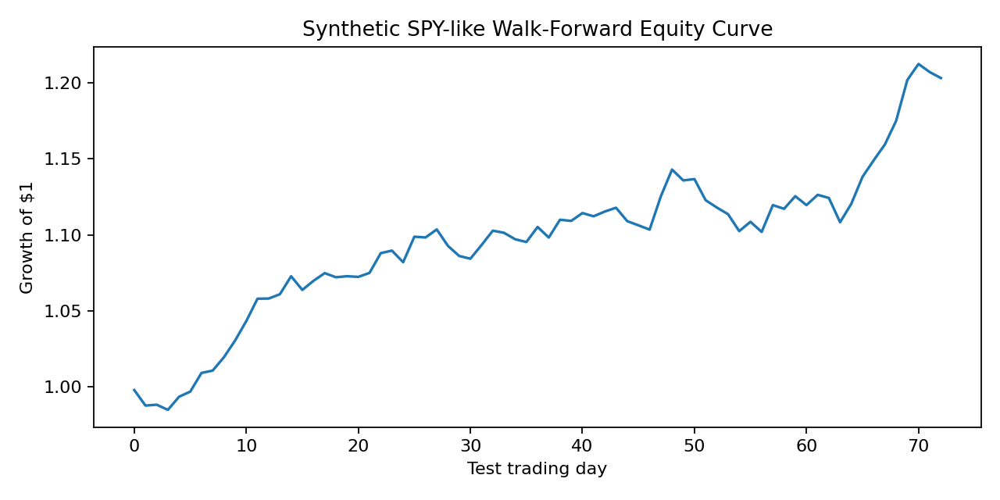

# Project 15 — SPY SOTA TimeSeries Alpha: Creative Replication

**Reference:** `15_spy_timeseries_sota_forecasting`

## Objective

Replicate the reference project's financial-machine-learning concepts using chronological walk-forward testing and risk-aware evaluation.

## What I Replicated

The local implementation preserves lagged-return prediction, chronological testing, directional accuracy, strategy returns, Sharpe ratio, and maximum drawdown concepts.

## What I Changed / Improved

1. Replaced the heavyweight Chronos, PatchTST, and TFT stack with a lightweight Ridge model for reproducibility.
2. Added an explicit **zero-return baseline**.
3. Added **five-day momentum** and **ten-day volatility** features.
4. Used expanding-window walk-forward evaluation instead of a random split.
5. Added explicit **transaction-cost deductions** and retained maximum drawdown as a risk diagnostic.
6. Clearly labels the data as a **synthetic SPY-like proxy**.

## Results

| Model | Directional Accuracy | Sharpe | Maximum Drawdown |
|---|---:|---:|---:|
| Zero-return baseline | 50.00% | 0.00 | 0.00% |
| Ridge walk-forward | **60.27%** | **5.05** | **-3.59%** |

The performance metrics come from the synthetic educational experiment and should not be interpreted as evidence of real-market alpha.

## Evidence




Additional evidence: [`metrics.csv`](artifacts/metrics.csv), [`walk_forward_predictions.csv`](artifacts/walk_forward_predictions.csv), and [`risk_diagnostics.csv`](artifacts/risk_diagnostics.csv).

## Reproducibility

```bash
python replication.py
```

Validation tests are in [`tests/test_replication.py`](tests/test_replication.py).

## Limitations

The market data is synthetic and intentionally simplified. The Sharpe ratio and equity curve are therefore educational outputs rather than evidence of a deployable trading strategy.
